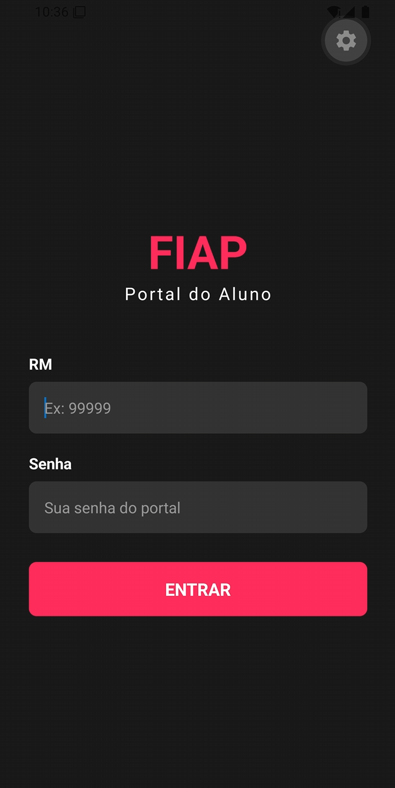
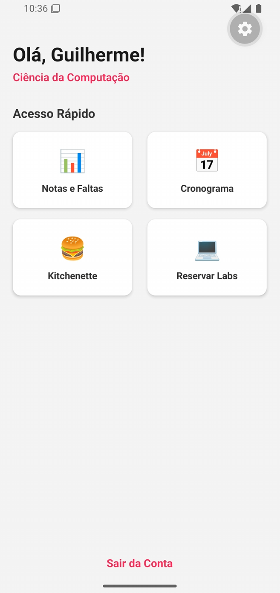
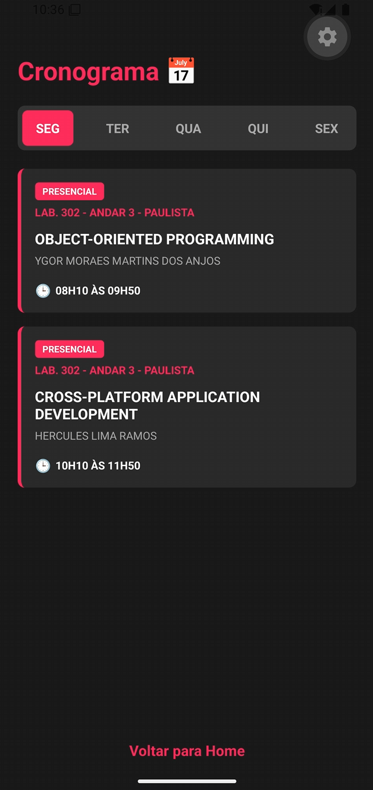
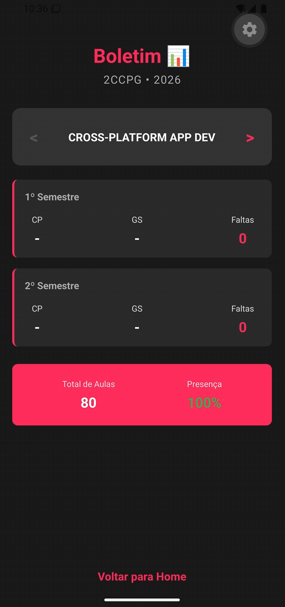
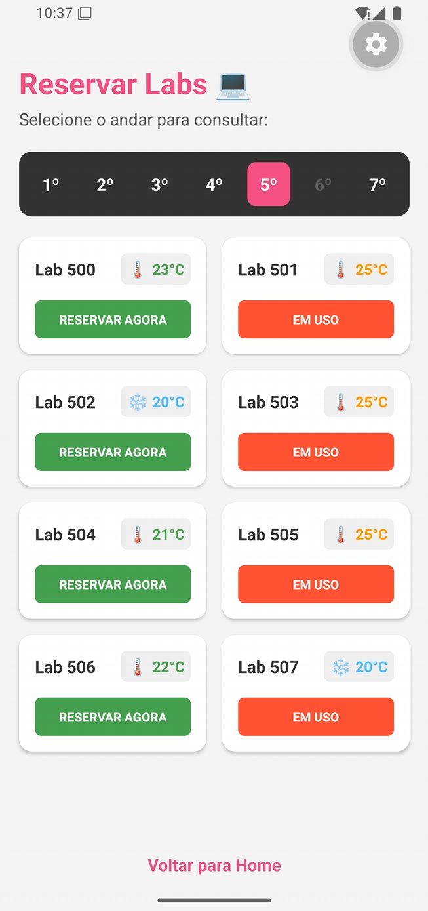
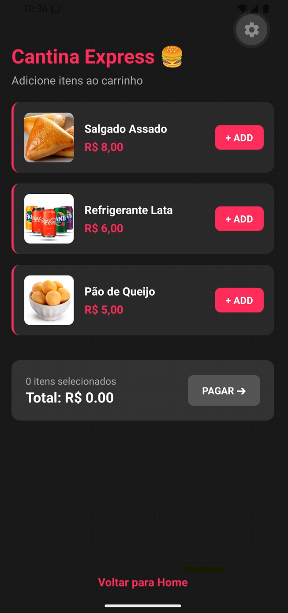
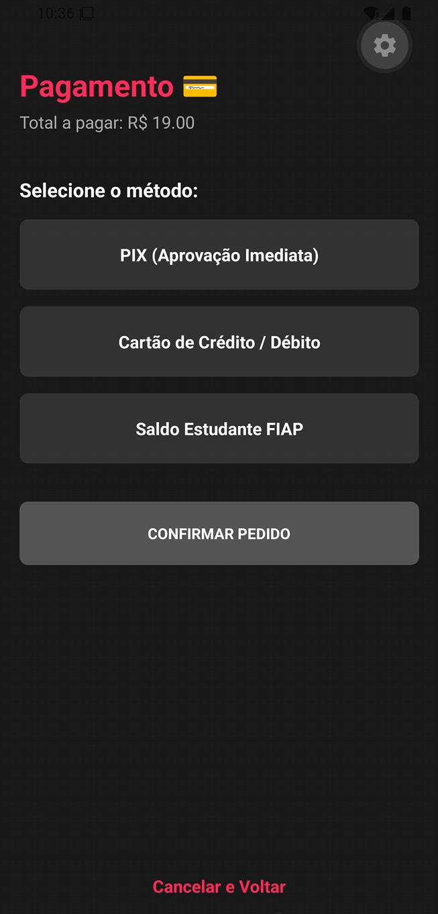

# FIAP-DSA

# 📱 FIAP Smart Campus

## a) Sobre o Projeto
**Nome do App:** FIAP Smart Campus  
**Operação Escolhida:** Otimização do tempo do aluno no campus (Cantina, Laboratórios e Fluxo de Pessoas).

**Descrição e Porquê:** A rotina na FIAP é intensa. Identificamos que os alunos perdem muito tempo útil enfrentando filas na cantina no intervalo, procurando laboratórios livres para estudar (ou com o ar condicionado agradável) e lidando com a superlotação nos elevadores e catracas. Escolhemos resolver esse problema centralizando os serviços do dia a dia em um único "Smart App" na palma da mão.

**Funcionalidades Implementadas:**
- **Cantina Express:** Fluxo completo de carrinho de compras e pagamento simulado para retirada rápida no balcão.
- **Radar FIAP:** Monitoramento em tempo real (crowdsourcing/IoT) da lotação dos elevadores, catracas e áreas comuns.
- **FIAP Labs:** Consulta de disponibilidade de laboratórios e temperatura do ar condicionado filtrados por andar.
- **Portal do Aluno:** Acesso rápido ao cronograma de aulas dinâmico e boletim de notas em formato dashboard.

---

## b) Integrantes do Grupo
* **Guilherme Willians** - RM: [565919] - Ciência da Computação
* **[Kauã Lazarim]** - RM: [564625] - Ciência da Computação
* **[Nelson Troccoli]** - RM: [562815] - Ciência da Computação

---

## c) Como Rodar o Projeto

**Pré-requisitos:**
- Node.js instalado no computador.
- Aplicativo **Expo Go** instalado no smartphone (iOS ou Android).

**Passo a Passo:**
1. Clone este repositório:
   \`\`\`bash
   git clone https://github.com/seu-usuario/fiap-cpad-cp1-smart-campus.git
   \`\`\`
2. Navegue até a pasta do projeto:
   \`\`\`bash
   cd fiap-cpad-cp1-smart-campus
   \`\`\`
3. Instale as dependências:
   \`\`\`bash
   npm install
   \`\`\`
4. Inicie o servidor de desenvolvimento:
   \`\`\`bash
   npx expo start
   \`\`\`
5. Abra o aplicativo **Expo Go** no seu celular e escaneie o QR Code exibido no terminal.

---

## d) Demonstração

  
  
  
  
  
  
   

  <video src="./assets/aplicativo.mp4" width="400" controls></video>

## e) Decisões Técnicas

- **Estrutura e Navegação:** Utilizamos o **Expo Router** para implementar a navegação baseada em arquivos (*file-based routing*). Escolhemos a estrutura de `Stack` para garantir transições fluidas entre as telas, utilizando `router.push()` para empilhar navegações e `router.replace()` no login para evitar retornos acidentais de segurança.
- **Gerenciamento de Estado (Hooks):** O `useState` foi a espinha dorsal do projeto. Ele foi utilizado extensivamente para controlar o carrinho da cantina, renderização condicional de etapas de pagamento, troca de andares nos laboratórios e paginação do boletim de notas, garantindo que o app reagisse imediatamente às interações do usuário sem recarregar a tela.
- **Ciclo de Vida (Hooks):** Aplicamos o `useEffect` para simular requisições assíncronas a APIs e sensores IoT. O destaque técnico vai para a tela "Radar FIAP", onde o `useEffect` trabalha em conjunto com o `setInterval` para atualizar as barras de progresso dinamicamente, simulando um monitoramento em tempo real.
- **Estilização e Responsividade:** Todas as interfaces foram construídas usando os componentes Core (`View`, `Text`, `Image`, `TouchableOpacity`) estilizados via `StyleSheet`. A responsividade foi garantida através do **Flexbox**, utilizando propriedades como `flexDirection: 'row'`, `justifyContent` e `flexWrap` para criar grids que se adaptam perfeitamente a qualquer tamanho de tela mobile.

---

## f) Próximos Passos
Se tivéssemos mais tempo para evoluir este MVP, implementaríamos:
1. Integração real com as APIs da catraca e sensores de IoT das salas (temperatura e presença) usando Axios.
2. Sistema real de autenticação vinculado ao Azure AD da FIAP.
3. Notificações Push para avisar o aluno quando o pedido da cantina estiver pronto no balcão.